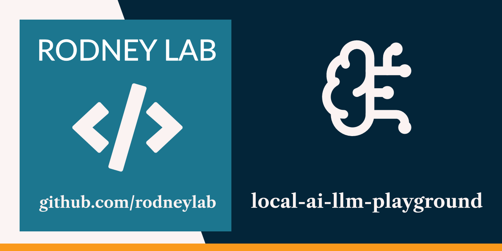

  

<h1 align="center">
  local-ai-llm-playground
</h1>

**Experiments running offline LLMs in Python and Rust locally using Ollama and
llama.cpp**

## Examples

<dl>
<dt>llamacpp-gemma3-4b-completion</dt>
<dd><a href="./python/ollama_mistral_instruct_chat/README.md">Gemma3 LLM completion demo calling local llama.cpp server from Rust code.</a></dd>

<dt>ollama-mistral-instruct-chat</dt>
<dd><a href="./crates/llamacpp_gemma3_4b_completion/README.md">Mistral LLM chat demo calling local Ollama server from Python code.</dd>
</dl>

## ☎️ Issues

Feel free to jump into the
[Rodney Lab matrix chat room](https://matrix.to/#/%23rodney:matrix.org).
