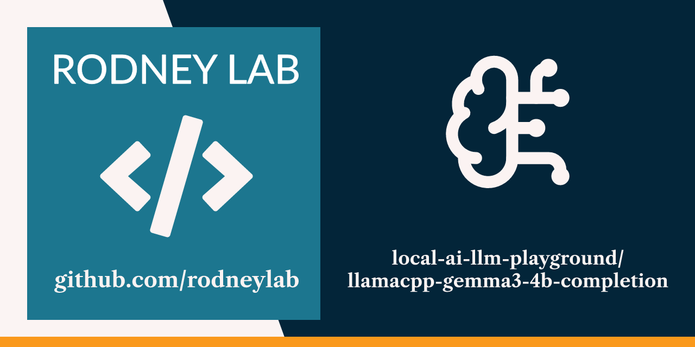

<p align="center">
  <a aria-label="Open Rodney Lab site" href="https://rodneylab.com" rel="nofollow noopener noreferrer">
    
  </a>
</p>
<h1 align="center">
llamacpp-gemma3-4b-completion
</h1>

**Large Language Model chat demo calling local llama.cpp server from Rust code.**

## 📝 Key details

<dl>
  <dt>Server</dt>
  <dd>llama.cpp</dd>

<dt>Model</dt>
  <dd><a href="https://huggingface.co/google/gemma-3-4b-it-qat-q4_0-gguf">Gemma3 4B parameters, instruction-trained (gemma3-4b-it)</a></dd>

<dt>Model download size</dt>
  <dd>3.16GB</dd>
</dl>

## 🖥️ Running the example:


To set up llama.cpp to run locally using Homebrew on macOS run:

```shell
brew install llama.cpp
```

Then, download and serve the model:

```shell
llama-server -hf google/gemma-3-4b-it-qat-q4_0-gguf
```

By default, `llama-server` will listen on port `8080`; the port the example app is
configured to use.

For other operating systems, or more details, see the
[LLaMA.cpp HTTP Server Quick Start Guide](https://github.com/ggml-org/llama.cpp/tree/master/tools/server#quick-start).

Clone this repo and from the repository root folder run:

```shell
cargo run --bin llamacpp_gemma3_4b_completion
```

Code makes use of the server’s REST API.

## 🧐 What’s inside?

Main Rust file is at [./src/main.rs](./src/main.rs).

## Inspiration

- [GitHub ggml-org/llama.cpp - Tools - Server - Testing with CURL](https://github.com/ggml-org/llama.cpp/tree/master/tools/server#testing-with-curl)

## ☎️ Issues

Feel free to jump into the
[Rodney Lab matrix chat room](https://matrix.to/#/%23rodney:matrix.org).
