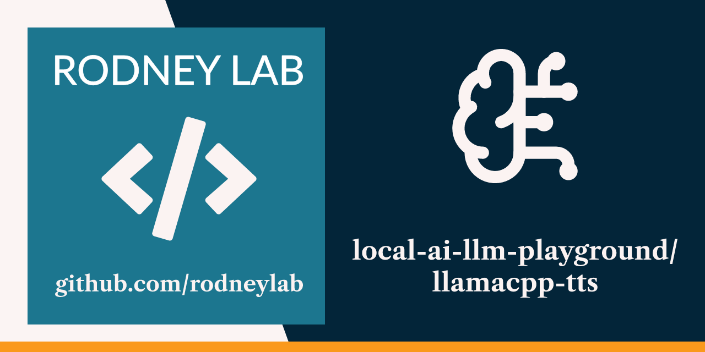

<p align="center">
  <a aria-label="Open Rodney Lab site" href="https://rodneylab.com" rel="nofollow noopener noreferrer">
    
  </a>
</p>
<h1 align="center">
llamacpp-tts
</h1>

**LLM text-to-speech (TTS) demo with voice cloning using LLama.cpp and OuteTTS in Python code.**

## 📝 Key details

<dl>
<dt>Model</dt>
  <dd><a href="https://huggingface.co/OuteAI/Llama-OuteTTS-1.0-1B-GGUF/resolve/main/Llama-OuteTTS-1.0-1B-Q8_0.gguf">OuteTTS-1.0-1B-Q8_0</a></dd>

<dt>Capabilities</dt>
  <dd>text-to-speech</dd>

<dt>Model download size</dt>
  <dd>1.3GB</dd>
</dl>

## 🖥️ Running the example:

To set up llama.cpp to run locally using Homebrew on macOS run:

```shell
brew install llama.cpp
```

For other operating systems, or more details, see the
[LLaMA.cpp HTTP Server Quick Start Guide](https://github.com/ggml-org/llama.cpp/tree/master/tools/server#quick-start).

There is no need to download the models manually. Running the code
automatically download models needed.

<details>
<summary>
This project uses uv to manage Python packages. Expand to see how to set it up if
needed.
</summary>
You can set up uv
with Astral's stand-alone installer on macOS or Linux:

```shell
curl -LsSf https://astral.sh/uv/install.sh | sh
```

or using a system package manager, Homebrew, for example on macOS (`brew install
uv`). See Astral [Installing uv guide for more options](https://docs.astral.sh/uv/getting-started/installation/).

</details>

### Hello world

To get going, clone this repo and from the repository root folder run:

```shell
uv run python/llamacpp_tts/src/main.py tts -t "Hello! How do you do?"`
```

This will save a wav file containing the spoken audio Hello! How do you do?"
using the default voice. You can also train the model to use a voice from a short audio
recording (see below). The first time you run that last command, it will download the OuteTTS model, which
might take a little while.

The audio is saved to `output.wav` in the working directory. You can play it back using
VLC or IINA, or in the Terminal on macOS:

```
afplay output.wav
```

On Linux use aplay instead (`aplay output.wav`).

[(https://raw.githubusercontent.com/rodneylab/local-ai-llm-playground/main/assets/kipling-if-output.mp4)

### Training / Voice cloning

To clone a voice you will need a short wav clip (15 seconds should be enough). You can use FFmpeg to strip audio from an MP4 video or convert MP3 or AAC to wav. Running the model in training mode, creates a speaker JSON file that you can use for voicing text going forward.

```shell
uv run python/llamacpp_tts/src/main.py train \
    -f python/llamacpp_tts/data/some_speaker.wav \
    -o python/llamacpp_tts/speakers/some_speaker.json
```

Here, we are running in **train** mode, take `some_speaker.wav` as the input audio and
create the speaker file `some_speaker.json`.

Running the command will start a one-off download of the [Whisper automatic speech
recognition (ASR) model](https://openai.com/index/whisper/), and a wav tokeniser. All models run locally, and work offline, after initial download.

Once you have the speaker file, you can use it to voice some text as before,
this time with the new cloned voice:

```shell
uv run python/llamacpp_tts/src/main.py tts -t "Hello! How do you do?" \
    -s python/llamacpp_tts/speakers/some_speaker.json
```

[(https://raw.githubusercontent.com/rodneylab/local-ai-llm-playground/main/assets/kipling-if-output.mp4)

## 🧐 What's inside?

Main Python file is at [./src/main.py](./src/main.py).

## Inspiration

- [llama.cpp](https://github.com/ggml-org/llama.cpp/tree/master/tools/tts#quickstart)
- [OuteTTS](https://github.com/edwko/OuteTTS/blob/main/docs/interface_usage.md)

## ☎️ Issues

Feel free to jump into the
[Rodney Lab matrix chat room](https://matrix.to/#/%23rodney:matrix.org).
