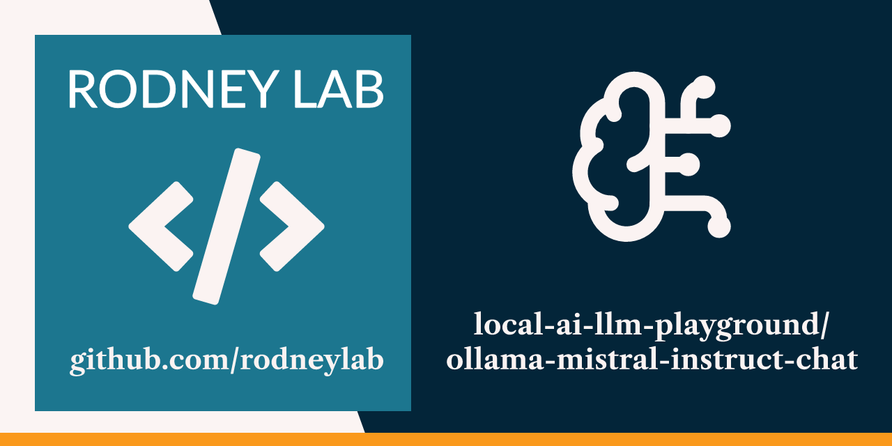

<p align="center">
  <a aria-label="Open Rodney Lab site" href="https://rodneylab.com" rel="nofollow noopener noreferrer">
    
  </a>
</p>
<h1 align="center">
ollama-mistral-instruct-chat
</h1>

**Large Language Model chat demo calling local Ollama server from Python code.**

## 📝 Key details

<dl>
<dt>Server</dt>
  <dd>Ollama</dd>

<dt>Model</dt>
  <dd><a href="https://ollama.com/library/mistral">Mistral-7B-Instruct-v0.3</a></dd>

<dt>Capabilities</dt>
  <dd>completion, tools</dd>

<dt>Model download size</dt>
  <dd>4.1GB</dd>
</dl>

## 🖥️ Running the example:


To set up Ollama to run locally using Homebrew on macOS run:

```shell
brew install ollama
```

For other operating systems, or more details, see the
[Official Ollama Quickstart Guide](https://ollama.readthedocs.io/en/quickstart/).

Next, to get the model:

```shell
ollama pull mistral:7b
```

Finally, start the server:

```shell
ollama serve
```

Clone this repo and from the repository root folder run:

```shell
uv run python/ollama_mistral_instruct_chat/src/main.py
```

At the `>>>` prompt, type a question for Mistral to answer then press the ENTER
key to submit it. The model will start responding after a short delay. Type
`/exit` to quit, when you are done.

Code makes use of the server’s REST API.

## 🧐 What's inside?

Main Python file is at [./src/main.py](./src/main.py).

## Inspiration

- [Run RAG Locally using Mistral Ollama and LangChain](https://mobiarch.wordpress.com/2024/02/19/run-rag-locally-using-mistral-ollama-and-langchain/)

## ☎️ Issues

Feel free to jump into the
[Rodney Lab matrix chat room](https://matrix.to/#/%23rodney:matrix.org).
